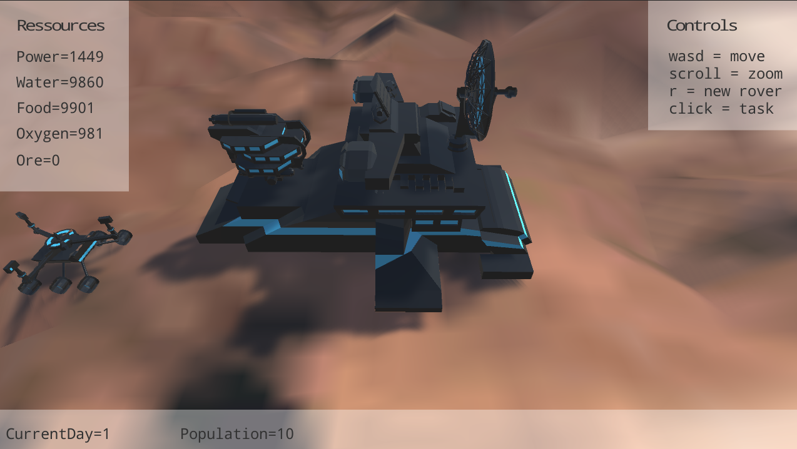
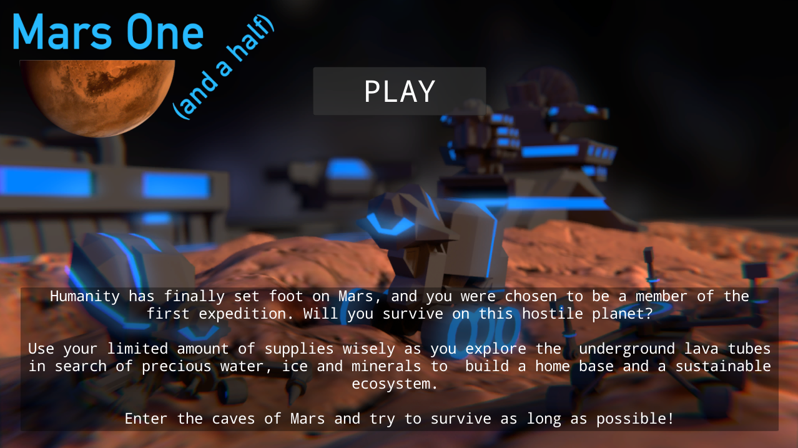

Mars One (and a half)
======================

* Space Apps 2015 project

Description
-----------

Humanity has finally set foot on Mars, and you were chosen to be  a member of
the first expedition. Will you survive on this hostile  planet? Use your 
limited amount of supplies wisely as you explore the  underground lava tubes
in search of precious water, ice and minerals to  build a home base and a
sustainable ecosystem.

